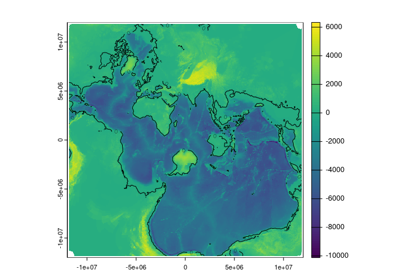

<!-- README.md is generated from README.Rmd. Please edit that file -->

# spilhaus

<!-- badges: start -->
<!-- badges: end -->

The goal of spilhaus is to convert coordinates to and from Spilhaus
projection.

Note that this R package was adapted from code available at
<https://github.com/rtlemos/spilhaus>, we took the functions
`from_lonlat_to_spilhaus_xy` and `from_spilhaus_xy_to_lonlat`.

## Installation

You can install the development version of spilhaus from
[GitHub](https://github.com/) with:

``` r
# install.packages("remotes")
remotes::install_github("mdsumner/spilhaus")
```

## Example

This is a basic example.

``` r
library(spilhaus)

m <- do.call(cbind, maps::map(plot = F)[1:2])

xy <- spilhaus(m)

plot(xy, asp = 1, pch = ".")
```


Note the range of the values

``` r
range(xy, na.rm = T)
#> [1] -11825248  11825538
```

Let’s create a raster and project some data to that.

``` r
library(terra)
#> terra 1.7.78

r0 <- rast(ext(c(-1, 1, -1, 1) * 1.2e7), ncols = 1024, nrows = 1024)

dsn <- "/vsicurl/https://gebco2023.s3.valeria.science/gebco_2023_land_cog.tif"
## just to get a lowres test
topo <- project(rast(dsn), rast(res = .25), by_util = TRUE)


r <- setValues(r0, extract(topo, spilhaus_lonlat(xyFromCell(r0, seq_len(ncell(r0)))))[,1L])
#> Warning in sin(lat_s_rad): NaNs produced
#> Warning in cos(lat_s_rad): NaNs produced
#> Warning in cos(lon_s_rad - beta): NaNs produced
#> Warning in cos(lat_s_rad): NaNs produced
#> Warning in sin(lon_s_rad - beta): NaNs produced
#> Warning in cos(lat_s_rad): NaNs produced
#> Warning in cos(lon_s_rad - beta): NaNs produced
#> Warning in sin(lat_s_rad): NaNs produced
plot(r)
```



Or some SST ocean data.

``` r
## this is just a meaningless example, use any raster, project to this crs when doing the extract below
dsn <- "/vsicurl/https://github.com/mdsumner/cog-example/raw/refs/heads/main/cog/ghrsst/20020602090000-JPL-L4_GHRSST-SSTfnd-MUR-GLOB-v02.0-fv04.1.tif"

## just to get a lowres test
sst <- project(rast(dsn), rast(res = 0.25), by_util = TRUE)


r <- setValues(r0, extract(sst, spilhaus_lonlat(xyFromCell(r0, seq_len(ncell(r0)))))[,1L])
#> Warning in sin(lat_s_rad): NaNs produced
#> Warning in cos(lat_s_rad): NaNs produced
#> Warning in cos(lon_s_rad - beta): NaNs produced
#> Warning in cos(lat_s_rad): NaNs produced
#> Warning in sin(lon_s_rad - beta): NaNs produced
#> Warning in cos(lat_s_rad): NaNs produced
#> Warning in cos(lon_s_rad - beta): NaNs produced
#> Warning in sin(lat_s_rad): NaNs produced
plot(r, background = "black")
```


## Code of Conduct

Please note that the spilhaus project is released with a [Contributor
Code of
Conduct](https://contributor-covenant.org/version/2/1/CODE_OF_CONDUCT.html).
By contributing to this project, you agree to abide by its terms
